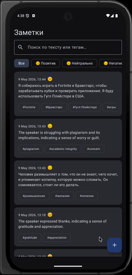
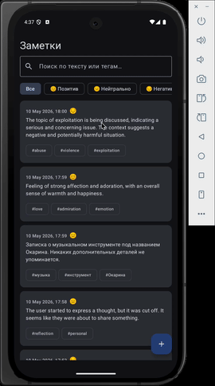
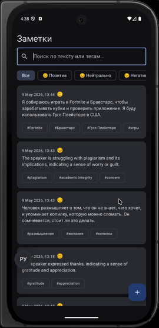

# VoiceIntent 🎙️

> AI-powered voice diary for Android. Record your thoughts by voice — the app transcribes, analyzes, and organizes them automatically.


---

## About

VoiceIntent is a personal voice notes where AI does the heavy lifting. After recording, Groq's Whisper transcribes your speech and Llama 3.3 extracts structured metadata — tags, tasks, mood, and a summary. Everything is stored locally in a Room database.

**Supported languages:** Russian · English · Armenian · Auto-detect

---

## Features

### 🎙️ Voice Recording & AI Analysis

<p align="center">
  
</p>

Record your thoughts hands-free. The app runs a foreground service so recording continues even if you switch apps. A live waveform visualizes your voice in real time.

Once you stop, Groq Whisper transcribes your audio and Llama 3.3 instantly extracts:
- **Tags** — key topics from your entry
- **Tasks** — action items mentioned
- **Mood** — Positive / Neutral / Negative
- **Summary** — a one-sentence recap

---

### 📋 Notes List

<p align="center">
  
</p>

All notes in one place. Search by transcript text, filter by mood or tag, pull to refresh.

---

### 📖 Note Details & Playback

<p align="center">
  
</p>

Open any note to read the full transcript, see extracted metadata, and replay the original audio with seek controls.

---

## Tech Stack

| Layer | Technology |
|-------|-----------|
| **Language** | Kotlin 2.3.20 |
| **UI** | Jetpack Compose + Material Design 3 |
| **Architecture** | Clean Architecture · Feature-first · MVVM |
| **DI** | Hilt 2.59.2 |
| **Database** | Room 2.8.4 |
| **Networking** | Retrofit 3.0 · OkHttp 5.3 |
| **Serialization** | kotlinx.serialization 1.11 |
| **Navigation** | Navigation Compose 2.9 |
| **AI API** | Groq (Whisper + Llama 3.3) |

**Min SDK:** 24 (Android 7.0) · **Target SDK:** 36 (Android 15)

---

## Architecture

The project follows **Clean Architecture** with **feature-first vertical slices**. Each feature is self-contained across all layers:

```
feature/{featureName}/
├── data/
│   ├── api/          ← Retrofit interfaces, API models
│   ├── db/           ← Room DAO, Entity, converters
│   └── repository/   ← repository implementations
├── domain/
│   ├── entity/       ← domain models (pure Kotlin)
│   ├── repository/   ← repository interfaces
│   └── use_case/     ← business logic
└── presentation/
    ├── screen/       ← Composable + ViewModel + State
    ├── composable/   ← reusable UI components
    └── service/      ← Android Services (record only)
```

---

## Project Structure

```
app/src/main/java/com/example/voiceintent/
├── di/                    ← Hilt modules (network, db, coroutines, repositories)
├── feature/
│   ├── record/            ← voice recording
│   ├── note_analysis/     ← AI transcription + analysis
│   ├── notes/             ← notes list + filters
│   ├── note_details/      ← note detail + audio playback
│   ├── note/              ← shared note data layer (Room, domain)
│   └── tag/               ← tag data layer
├── navigation/            ← Screen routes + NavHost
├── shared/
│   ├── ui/theme/          ← Material 3 theme, custom color extensions
│   └── network/           ← OkHttp interceptors
├── MainActivity.kt
└── VoiceIntentApplication.kt
```

---

## License

```
MIT License — feel free to use, modify, and distribute.
```
